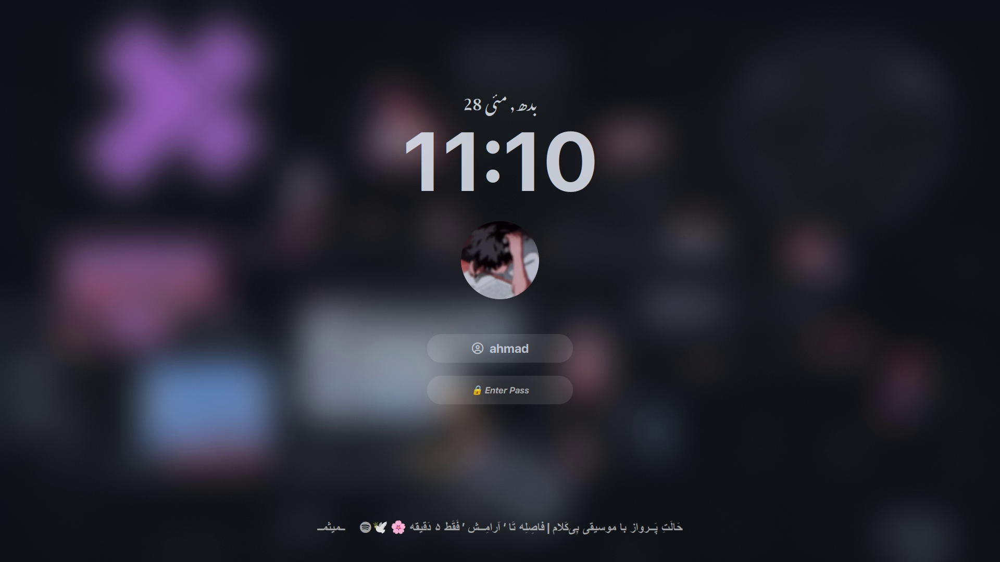
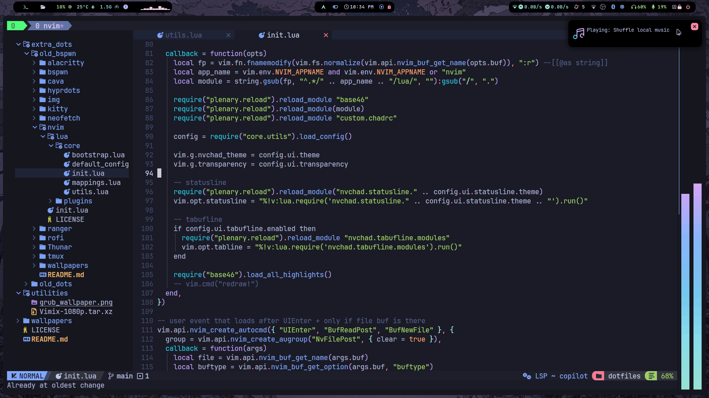
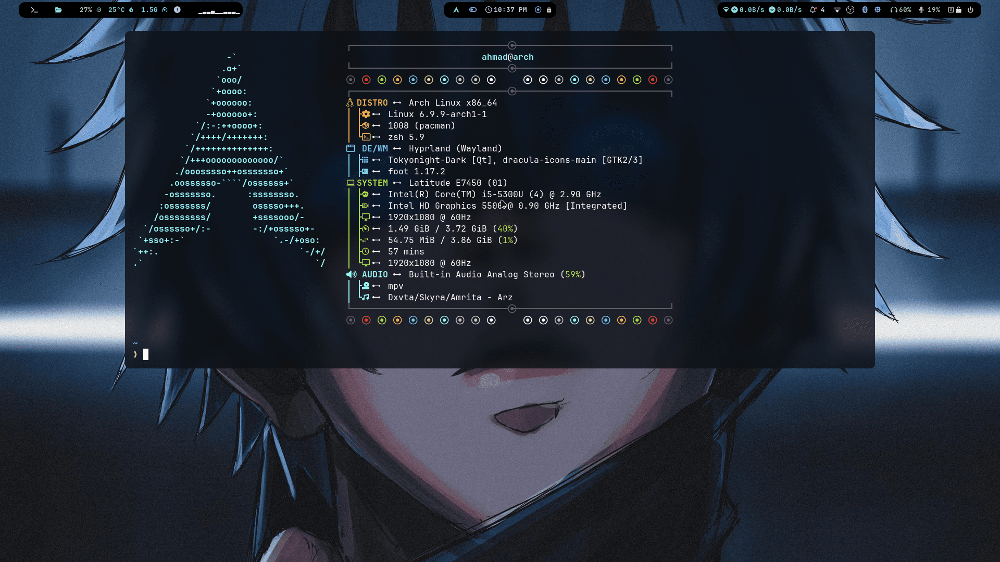
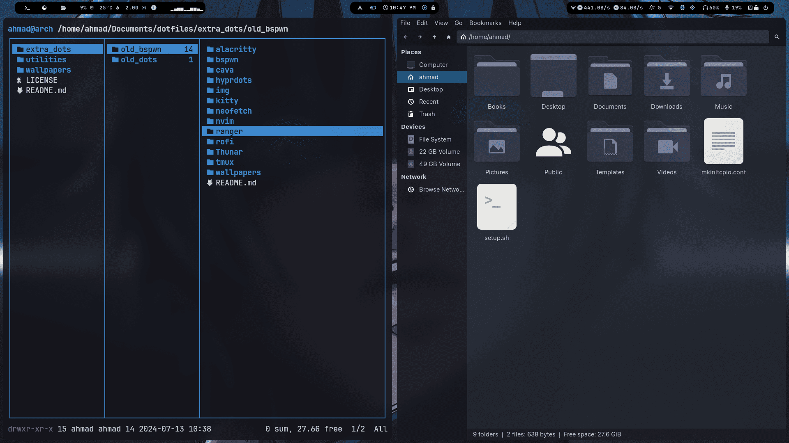
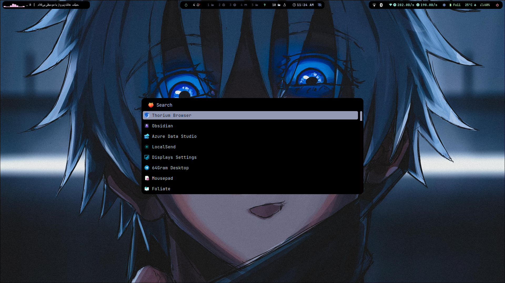

# HyprFlux

**Dotfiles** is a collection of configuration files aimed at setting up a personalized and efficient Linux environment. This repository includes configurations for various tools and applications, enhancing productivity and aesthetics.

## Review of Arch (btw)




|  |  |
| ------------------- | ------------------- |
|  |  |
|  |  |


I recently uploaded a video showcasing my Arch Linux (btw) setup just for fun, and to my surprise, it went viral within the Linux community! Since then, I’ve received numerous messages asking about the installation process. Although I wanted to make a detailed video tutorial, my laptop's older specs make it difficult to handle both recording and installation simultaneously. So, I’ve decided to write this article to guide you through the installation process using my dotfiles and the installation script from Ja.Kool.It. Below, you’ll find a step-by-step guide to get started.

## 1. Install ArchLinux With Minimal Configuration

- ### Make a Bootable USB

1. First Download ArchLinux ISO from official site : [Download Link](https://archlinux.org/download/)
2. Second Download for Your Operating System [Ventoy](https://github.com/ventoy/Ventoy/releases)
3. Extract the Ventoy Folder and Write it on your USB.
4. Copy ArchLinux ISO into USB.
   if you Don't Know how to use ventoy read this [article](https://itsfoss.com/use-ventoy/)

- ### Boot From USB

1. Restart Your Computer and Press the Boot Menu key according to your Computer.
2. In Boot Menu Select Your USB
3. It will open ventoy and show you all ISO file available in USB
4. Select the ArchLinux ISO and Open in Normal Mode.

- ### Connect to Internet

1. For wired internet you don't need to do anyting
2. For wireless Command Given Below

```bash
$ iwctl

[iwd]#
```

From the [iwd]# prompt you will need figure out your device name. Then, assuming you know the SSID (service set identifier) of your wireless network, go ahead and connect like so:

```bash
[iwd]# device list

# You should see something like this:
#
#                            Devices
# -------------------------------------------------------------
#   Name          Address          Powered    Adapter    Mode
# -------------------------------------------------------------
#   wlan0         ...              on         ...        ...

[iwd]# station YOURDEVICE connect YOURSSID
```

For a secured wireless network, you will be prompted for the WiFi password. Once you enter the correct password, you’ll be off to the races!

- ### Making Partition Ready for Archinstall
  for that first we will use the `cfdisk` to make partitions and then `mfks` for formatting that

```bash
$ lsblk
```

if will show your all partitions and there information


```bash
$ cfdisk
```

it show you all of your information about your drives


You have to make 3 partitions

1. EFI boot Partition - Type Must be EFI System
2. Swap Partition - Type Must be Swap Partition
3. Root Partition - Type Must be Linux File System

after Make Partitions write and exit the cfdisk and Run these commands and just change paths

```bash
$ mkfs.ext4 /path/to/root/partition
$ mfks.vfat -F 32 /path/to/efi/partition
$ mkswap /path/to/swap/partition
```

we will use the pre-mounted disk configuration for that run

```bash
$ mkdir /mnt/archinstall
$ mount /path/to/root/partition /mnt/archinstall
$ mkdir /mnt/archinstall/boot
$ mount /path/to/efi/partition/ /mnt/archinstall/boot
$ swapon /path/to/swap/partition
```

now we are done with partitioning the partitions

- ### Update System and Run ArchInstall

```bash
$ pacman -Sy archinstall archlinux-keyring

$ archinstall
```

- ### Actual Installation Start Here

After running the `archinstall` command it will show you something like this.


1. **Locales :** In locales select your _keyboard layout_, _locale language_, and _endcoding_
2. **Mirrors :** In Mirrors select best mirror region according to your location
3. **Disk Configuration :** ->Partitioning->Pre-mounted Configuration-> Enter `/mnt/archinstall`
4. **Swap :** Enable it if you made the swap partition
5. **Boot Loader :** Select which boot loader do you need like `grub`, `system-d-boot`
6. **Unified kernel images :** Enable if you want
7. **Hostname :** Select your hostname what you want
8. **Root Password :** Enter Your Root Password
9. **User account :** make a account for normal user
10. **Profile :** Select->Type->Minimal
11. **Audio :** Select->Pipewire
12. **Kernels :** Select one or many according your need. if don't know don't touch it
13. **Network configuration :** Select->Use NetworkManager
14. **Additional packages :** git vim
15. **Optional repositories :** Enable additional repos if you want like `multilib`
16. **Timezone :** Select timezone according to your location
17. **Automatic time sync (NTP) :** Leave Enabled

after that just press the `install` and wait for installation to be finished


Congratulations🎉!! You have successfully installed the ArchLinux and now you can say that _I use Arch btw_

## 2. Installing JaKooLit Arch-Hyprland Script.

reboot your system and login with username and password and connect with internet and clone the repo and preform these operations.

```bash
git clone --depth=1 https://github.com/JaKooLit/Arch-Hyprland.git ~/Arch-Hyprland
cd ~/Arch-Hyprland
chmod +x install.sh
./install.sh
```

select the option according the option given in image I have explained each one of them and those without comment means go with that are in image.


Select you prefered AUR Helper yay or paru


Select the Selected options must and others if you want.

After selecting all the options, It will start installing Hyprland and additional components. During the installation, you may be prompted to enter the password 2-3 times, so stay attentive. Once the installation is successful, it will show a prompt to press 'Y' to reboot the system.


You have successfully installed Archlinux+Hyprland.

## 3. My Dotfiles Configuration

To set up your environment using these dotfiles, follow these steps:

1. **Clone the Repository**:

```bash
git clone https://github.com/ahmad9059/dotfiles.git
cd dotfiles
```

2. **Run the Install Script**

```bash
./setup_dotfiles.sh
```


Follow the instruction on script as it prompt


Congratulations!🎉 You have successfully completed the installation.

# KeyBindings

## User KeyBindings

| Keybinding                   | Action / Command                                         | Description                               |
| ---------------------------- | -------------------------------------------------------- | ----------------------------------------- |
| **SUPER + D**                | `pkill rofi                                              | Open Rofi                                 |
| **SUPER + Return**           | `foot`                                                   | Open default terminal (foot)              |
| **SUPER + F**                | `thunar`                                                 | Open file manager (Thunar)                |
| **SUPER + K**                | `kitty`                                                  | Launch Kitty terminal                     |
| **SUPER + B**                | `firefox`                                                | Launch Firefox browser                    |
| **SUPER + R**                | `foliate`                                                | Launch Foliate eBook reader               |
| **SUPER + V**                | `$scriptsDir/ClipManager.sh`                             | Clipboard manager                         |
| **SUPER + C**                | `code --ozone-platform=x11`                              | Launch Visual Studio Code                 |
| **SUPER + O**                | `obsidian --ozone-platform=x11`                          | Launch Obsidian                           |
| **SUPER + S**                | `spotify-launcher`                                       | Launch Spotify                            |
| **SUPER + I**                | `vesktop`                                                | Launch Vesktop (Discord)                  |
| **SUPER + T**                | `(64gram-desktop\|telegram-desktop)`                     | Launch Telegram client                    |
| **SUPER + M**                | `fdm`                                                    | Launch Free Download Manager              |
| **SUPER + Shift + H**        | `$scriptsDir/KeyHints.sh`                                | Show help / cheat sheet                   |
| **SUPER + Shift + R**        | `$scriptsDir/Refresh.sh`                                 | Refresh Waybar, swaync, rofi              |
| **SUPER + Shift + E**        | `$scriptsDir/RofiEmoji.sh`                               | Open emoji picker                         |
| **SUPER + Shift + O**        | `$scriptsDir/ChangeBlur.sh`                              | Toggle blur settings                      |
| **SUPER + Shift + G**        | `$scriptsDir/GameMode.sh`                                | Toggle animations ON/OFF                  |
| **SUPER + Shift + L**        | `$scriptsDir/ChangeLayout.sh`                            | Toggle between Master and Dwindle layouts |
| **SUPER + Shift + P**        | `hyprpicker -a / –autocopy`                              | Color picker                              |
| **SUPER + Shift + V**        | `systemd-run --user --scope $scriptsDir/parrotOS-KVM.sh` | Start yazi in foot                        |
| **SUPER + Shift + B**        | `/home/ahmad/Documents/blog/quickScript.sh`              | Hugo file sync                            |
| **SUPER + Shift + F**        | `fullscreen`                                             | Toggle fullscreen                         |
| **SUPER + Shift + Return**   | `[float; move 15% 20% size 70% 60%] foot`                | Dropdown floating terminal                |
| **SUPER + Ctrl + F**         | `fullscreen, 1`                                          | Fake fullscreen                           |
| **SUPER + Space**            | `togglefloating`                                         | Toggle floating mode for window           |
| **SUPER + Alt + Space**      | `hyprctl dispatch workspaceopt allfloat`                 | Set all windows to floating               |
| **SUPER + Alt + Mouse Down** | Adjust `cursor:zoom_factor` ×2                           | Zoom in (magnifier)                       |
| **SUPER + Alt + Mouse Up**   | Adjust `cursor:zoom_factor` ÷2                           | Zoom out (magnifier)                      |
| **SUPER + Ctrl + Alt + B**   | `pkill -SIGUSR1 waybar`                                  | Toggle show/hide Waybar                   |
| **SUPER + Ctrl + B**         | `$scriptsDir/WaybarStyles.sh`                            | Waybar styles menu                        |
| **SUPER + Alt + B**          | `$scriptsDir/WaybarLayout.sh`                            | Waybar layout menu                        |
| **SUPER + Shift + M**        | `$UserScripts/RofiBeats.sh`                              | Play online music using Rofi              |
| **SUPER + Shift + W**        | `$UserScripts/WallpaperSelect.sh`                        | Wallpaper selection menu                  |
| **Ctrl + Alt + W**           | `$UserScripts/WallpaperRandom.sh`                        | Set random wallpaper                      |
| **SUPER + Ctrl + O**         | `hyprctl setprop active opaque toggle`                   | Toggle window opacity                     |
| **SUPER + Shift + K**        | `$scriptsDir/KeyBinds.sh`                                | Search keybinds via Rofi                  |
| **SUPER + Shift + A**        | `$scriptsDir/Animations.sh`                              | Hyprland animations menu                  |
| **SUPER + Alt + C**          | `$UserScripts/RofiCalc.sh`                               | Open calculator via Rofi                  |

## System KeyBindings

| Keybinding                     | Action                                 | Description                                     |
| ------------------------------ | -------------------------------------- | ----------------------------------------------- |
| `CTRL ALT + Delete`            | `exec hyprctl dispatch exit 0`         | Exit Hyprland                                   |
| `SUPER + Q`                    | `killactive`                           | Close active window (not kill)                  |
| `SUPER + SHIFT + Q`            | `exec KillActiveProcess.sh`            | Kill active process                             |
| `CTRL ALT + L`                 | `exec LockScreen.sh`                   | Screen lock                                     |
| `CTRL ALT + P`                 | `exec Wlogout.sh`                      | Power menu                                      |
| `SUPER + N`                    | `exec swaync-client -t -sw`            | Open swayNC notification panel                  |
| `SUPER + SHIFT + E`            | `exec Kool_Quick_Settings.sh`          | Open KooL Hyprland Settings menu                |
| `SUPER + CTRL + D`             | `layoutmsg removemaster`               | Remove master                                   |
| `SUPER + I`                    | `layoutmsg addmaster`                  | Add master                                      |
| `SUPER + J`                    | `layoutmsg cyclenext`                  | Cycle to next window                            |
| `SUPER + K`                    | `layoutmsg cycleprev`                  | Cycle to previous window                        |
| `SUPER + CTRL + Return`        | `layoutmsg swapwithmaster`             | Swap with master                                |
| `SUPER + SHIFT + I`            | `togglesplit`                          | Toggle split (only on dwindle layout)           |
| `SUPER + P`                    | `pseudo`                               | Toggle pseudo mode                              |
| `SUPER + M`                    | `exec hyprctl dispatch splitratio 0.3` | Set split ratio to 0.3                          |
| `SUPER + G`                    | `togglegroup`                          | Toggle group                                    |
| `SUPER + CTRL + Tab`           | `changegroupactive`                    | Change focus within group                       |
| `SUPER + J`                    | `cyclenext`                            | Cycle to next window                            |
| `SUPER + J`                    | `bringactivetotop`                     | Bring active window to top                      |
| `SUPER + Print`                | `exec ScreenShot.sh --now`             | Screenshot now                                  |
| `SUPER + SHIFT + Print`        | `exec ScreenShot.sh --area`            | Screenshot selected area                        |
| `SUPER + CTRL + Print`         | `exec ScreenShot.sh --in5`             | Screenshot after 5 seconds                      |
| `SUPER + CTRL + SHIFT + Print` | `exec ScreenShot.sh --in10`            | Screenshot after 10 seconds                     |
| `ALT + Print`                  | `exec ScreenShot.sh --active`          | Screenshot active window                        |
| `SUPER + SHIFT + S`            | `exec ScreenShot.sh --swappy`          | Screenshot with swappy                          |
| `SUPER + SHIFT + Left`         | `resizeactive -50 0`                   | Resize window left                              |
| `SUPER + SHIFT + Right`        | `resizeactive 50 0`                    | Resize window right                             |
| `SUPER + SHIFT + Up`           | `resizeactive 0 -50`                   | Resize window up                                |
| `SUPER + SHIFT + Down`         | `resizeactive 0 50`                    | Resize window down                              |
| `SUPER + CTRL + Left`          | `movewindow l`                         | Move window left                                |
| `SUPER + CTRL + Right`         | `movewindow r`                         | Move window right                               |
| `SUPER + CTRL + Up`            | `movewindow u`                         | Move window up                                  |
| `SUPER + CTRL + Down`          | `movewindow d`                         | Move window down                                |
| `SUPER + ALT + Left`           | `swapwindow l`                         | Swap window left                                |
| `SUPER + ALT + Right`          | `swapwindow r`                         | Swap window right                               |
| `SUPER + ALT + Up`             | `swapwindow u`                         | Swap window up                                  |
| `SUPER + ALT + Down`           | `swapwindow d`                         | Swap window down                                |
| `SUPER + Left`                 | `movefocus l`                          | Move focus left                                 |
| `SUPER + Right`                | `movefocus r`                          | Move focus right                                |
| `SUPER + Up`                   | `movefocus u`                          | Move focus up                                   |
| `SUPER + Down`                 | `movefocus d`                          | Move focus down                                 |
| `SUPER + Tab`                  | `workspace m+1`                        | Switch to next workspace                        |
| `SUPER + SHIFT + Tab`          | `workspace m-1`                        | Switch to previous workspace                    |
| `SUPER + U`                    | `togglespecialworkspace nyx`           | Toggle special workspace 'nyx'                  |
| `SUPER + SHIFT + U`            | `movetoworkspace special:nyx`          | Move window to special workspace 'nyx'          |
| `SUPER + 1-10`                 | `workspace 1-10`                       | Switch to workspace 1-10                        |
| `SUPER + SHIFT + 1-10`         | `movetoworkspace 1-10`                 | Move window to workspace 1-10                   |
| `SUPER + SHIFT + [ / ]`        | `movetoworkspace -1 / +1`              | Move window to previous/next workspace          |
| `SUPER + CTRL + 1-10`          | `movetoworkspacesilent 1-10`           | Move window to workspace silently 1-10          |
| `SUPER + CTRL + [ / ]`         | `movetoworkspacesilent -1 / +1`        | Move window to previous/next workspace silently |
| `SUPER + Mouse Scroll Down`    | `workspace e+1`                        | Scroll to next workspace                        |
| `SUPER + Mouse Scroll Up`      | `workspace e-1`                        | Scroll to previous workspace                    |
| `SUPER + .`                    | `workspace e+1`                        | Next workspace                                  |
| `SUPER + ,`                    | `workspace e-1`                        | Previous workspace                              |
| `SUPER + Left Mouse`           | `movewindow`                           | Move window with mouse                          |
| `SUPER + Right Mouse`          | `resizewindow`                         | Resize window with mouse                        |

## Neovim KeyBindings (NvChad + These Custom One's)

| Mode(s)                | Key(s)                  | Action / Command                                                     | Description               |
| ---------------------- | ----------------------- | -------------------------------------------------------------------- | ------------------------- |
| Normal                 | `;`                     | `:`                                                                  | Enter command mode        |
| Insert                 | `jk`                    | `<ESC>`                                                              | Exit insert mode          |
| Normal, Insert, Visual | `Ctrl + S`              | `<cmd> w <cr>`                                                       | Save file                 |
| Insert                 | `Alt + h`               | `<Left>`                                                             | Move left in insert mode  |
| Insert                 | `Alt + j`               | `<Down>`                                                             | Move down in insert mode  |
| Insert                 | `Alt + k`               | `<Up>`                                                               | Move up in insert mode    |
| Insert                 | `Alt + l`               | `<Right>`                                                            | Move right in insert mode |
| Normal                 | `Ctrl + A`              | `ggVG`                                                               | Select all                |
| Insert                 | `Ctrl + A`              | `<ESC>ggVG`                                                          | Select all in insert mode |
| Visual                 | `Ctrl + A`              | `<ESC>ggVG`                                                          | Select all in visual mode |
| Normal                 | `<leader>lg`            | `<cmd>LazyGit<CR>`                                                   | Open LazyGit              |
| Visual                 | `<leader>i{`            | `vi{`                                                                | Select inside `{}`        |
| Visual                 | `<leader>a{`            | `va{`                                                                | Select around `{}`        |
| Visual                 | `<leader>i(`            | `vi(`                                                                | Select inside `()`        |
| Visual                 | `<leader>a(`            | `va(`                                                                | Select around `()`        |
| Visual                 | `<leader>i[`            | `vi[`                                                                | Select inside `[]`        |
| Visual                 | `<leader>a[`            | `va[`                                                                | Select around `[]`        |
| Visual                 | `<leader>i"`            | `vi"`                                                                | Select inside `""`        |
| Visual                 | `<leader>a"`            | `va"`                                                                | Select around `""`        |
| Visual                 | `<leader>i'`            | `vi'`                                                                | Select inside `''`        |
| Visual                 | `<leader>a'`            | `va'`                                                                | Select around `''`        |
| Visual                 | `i``                    | `vi``                                                                | Select inside ` `` `      |
| Visual                 | `a``                    | `va``                                                                | Select around ` `` `      |
| Normal                 | `<leader>1`…`<leader>9` | Switch to buffer `1-9`                                               | Buffer navigation         |
| Normal, Terminal       | `Alt + i`               | `require("nvchad.term").toggle { pos="float", id="floatTerm", ... }` | Toggle floating terminal  |
| Normal                 | `Ctrl + h`              | `<cmd>TmuxNavigateLeft<CR>`                                          | Tmux navigate left        |
| Normal                 | `Ctrl + j`              | `<cmd>TmuxNavigateDown<CR>`                                          | Tmux navigate down        |
| Normal                 | `Ctrl + k`              | `<cmd>TmuxNavigateUp<CR>`                                            | Tmux navigate up          |
| Normal                 | `Ctrl + l`              | `<cmd>TmuxNavigateRight<CR>`                                         | Tmux navigate right       |
| Normal                 | `Ctrl + \`              | `<cmd>TmuxNavigatePrevious<CR>`                                      | Tmux navigate previous    |

## TMUX

| Keys / Combo                | Mode / Context  | Action                                                |
| --------------------------- | --------------- | ----------------------------------------------------- |
| **r**                       | Prefix required | Reload `~/.tmux.conf`                                 |
| **M-o**                     | Global          | Tmux prefix key                                       |
| **Mouse**                   | Global          | Mouse support enabled                                 |
| **\***                      | Prefix required | Split window horizontally                             |
| **l**                       | Prefix required | Select left pane                                      |
| **j**                       | Prefix required | Select pane below                                     |
| **k**                       | Prefix required | Select pane above                                     |
| **h**                       | Prefix required | Select right pane                                     |
| **C-h**                     | Global (normal) | If in Vim → send `C-h`, else select left pane         |
| **C-j**                     | Global (normal) | If in Vim → send `C-j`, else select pane below        |
| **C-k**                     | Global (normal) | If in Vim → send `C-k`, else select pane above        |
| **C-l**                     | Global (normal) | If in Vim → send `C-l`, else select right pane        |
| \*\*C-\*\*                  | Global (normal) | If in Vim → send `C-\\`, else select last active pane |
| **C-h**                     | Copy-mode (vi)  | Select left pane                                      |
| **C-j**                     | Copy-mode (vi)  | Select pane below                                     |
| **C-k**                     | Copy-mode (vi)  | Select pane above                                     |
| **C-l**                     | Copy-mode (vi)  | Select right pane                                     |
| \*\*C-\*\*                  | Copy-mode (vi)  | Select last active pane                               |
| **M-1** to **M-9**, **M-0** | Global          | Select window 1–10                                    |
